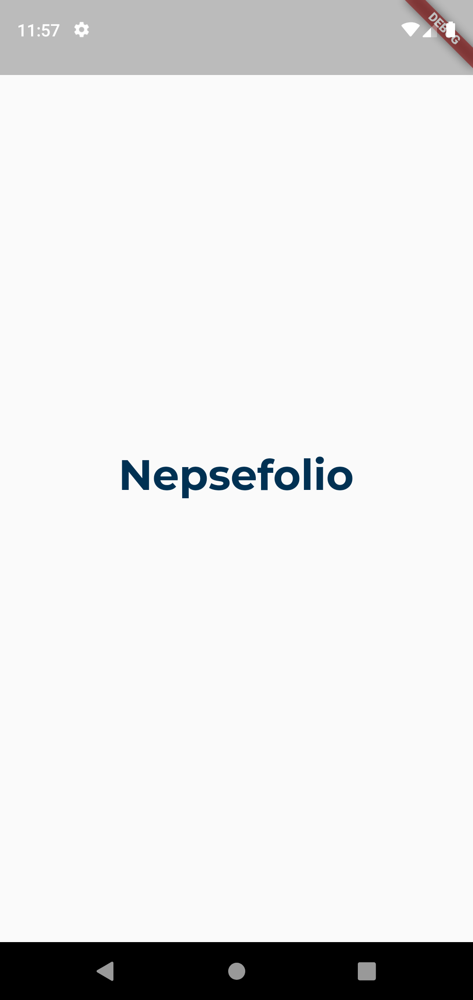
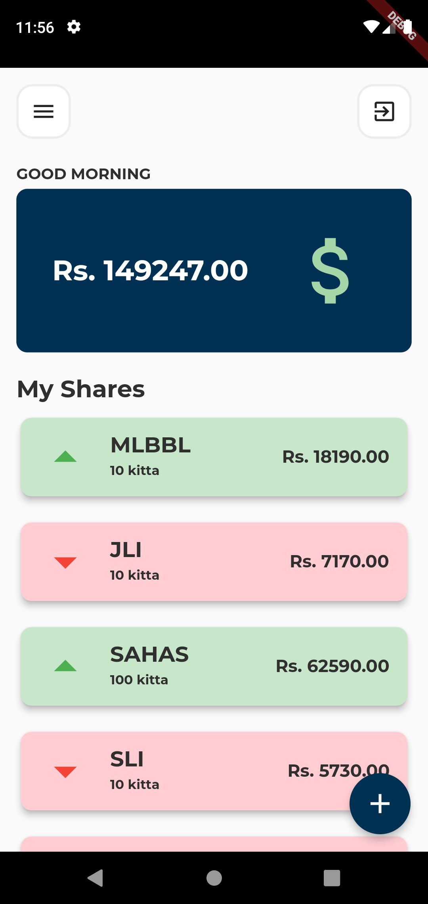
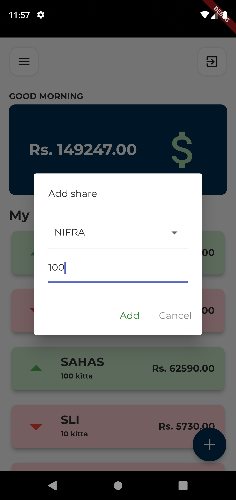
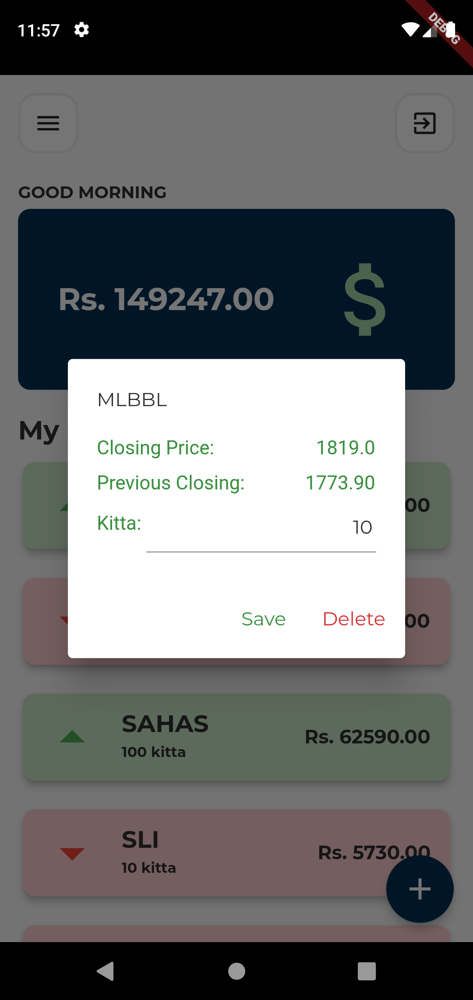
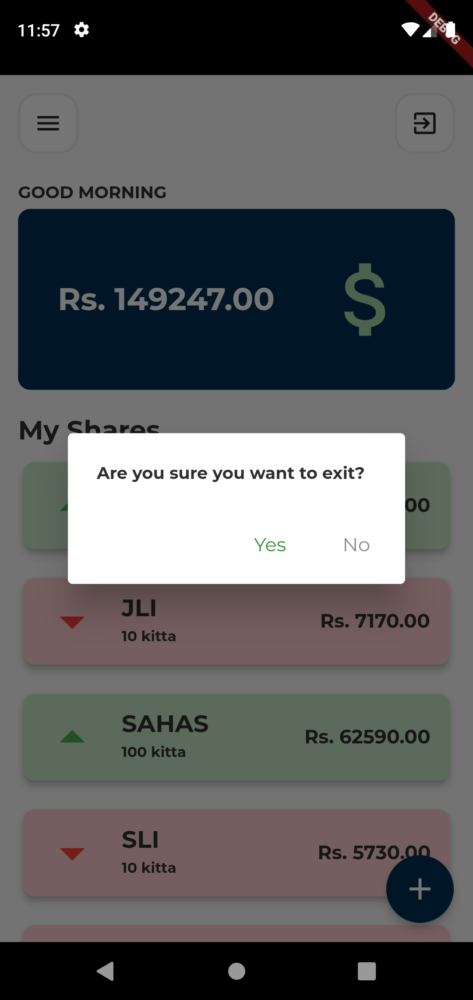

# Nepsefolio
A simple mobile application for NEPSE portfolio tracking

## App screenshots

## Download
<a href="https://github.com/diwash007/Nepsefolio/releases/download/v1.0.0-beta/app-release.apk">
    <button style="
    border: none;
    color: white;
    padding: 15px 32px;
    text-align: center;
    text-decoration: none;
    display: inline-block;
    font-size: 16px;
    margin: 4px 2px;
    cursor: pointer;"
    >
        Download Nepsefolio v1.0.0-beta
    </button>
</a>